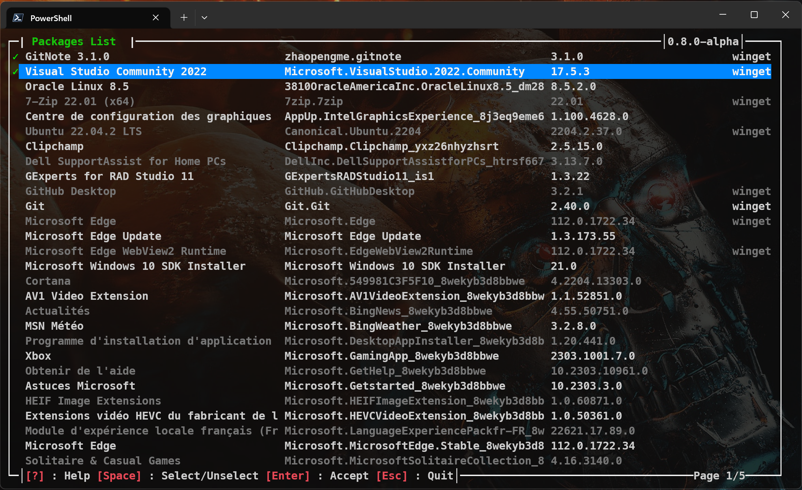
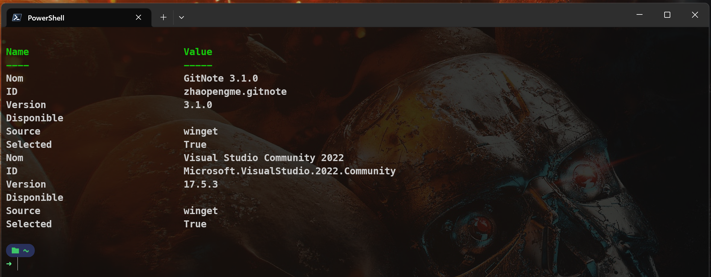
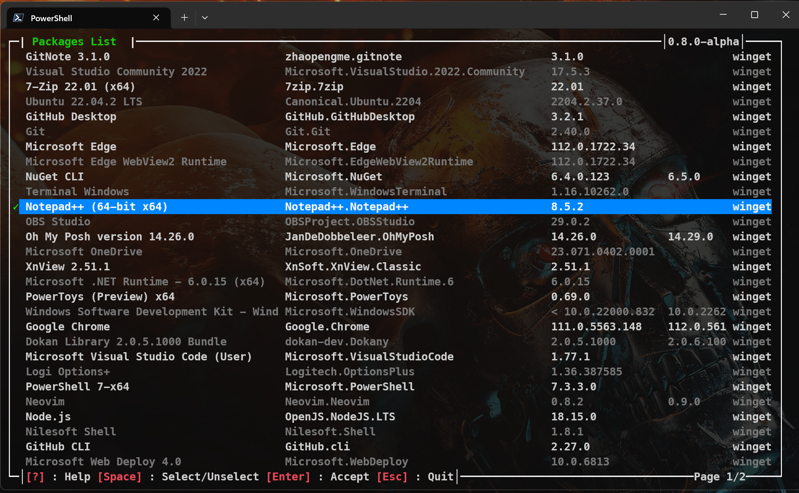
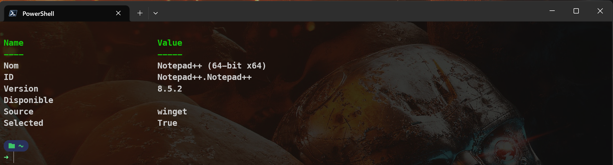
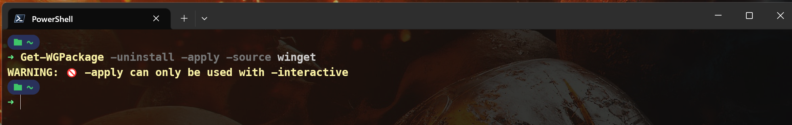
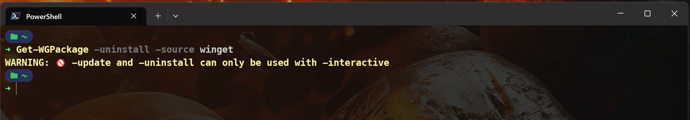
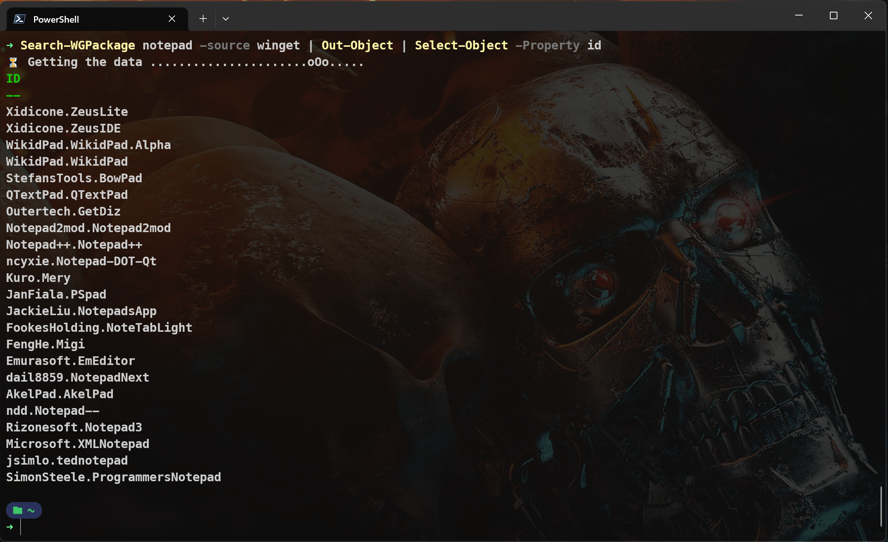
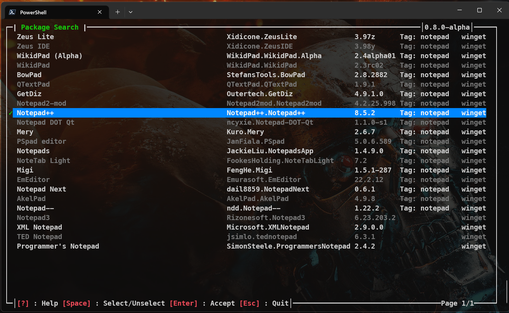
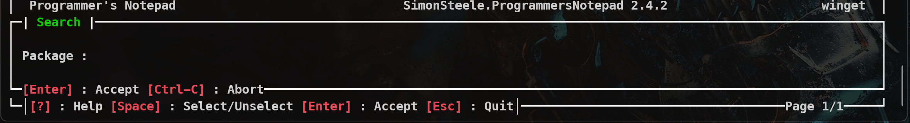

# Wingetposh 0.8.0-alpha

***
```
CommandType     Name                                               Version    Source
-----------     ----                                               -------    ------
Function        Get-WGPackage                                      0.8.0      wingetposh
Function        Invoke-Winget                                      0.8.0      wingetposh
Function        Out-Object                                         0.8.0      wingetposh
Function        Search-WGPackage                                   0.8.0      wingetposh
```
***

- Number of function reduced
- Using animations for the long processing tasks
- New parameters added
(beta)
- Using localized resources from winget repository
- Polished animations
- Minor bugfixes

## Installation
```
  Install-module wingetposh -scope currentuser -allowprerelease
```

## Get-WGPackage

```
  Get-WGPackage [-source] [-interactive] [-uninstall] [-update] [-apply]
```
- -source : Specify the source to filter on
- -interactive : Switch that command the display of the GUI
- -uninstall : switch to specify if the selected packages will be uninstalled
- -update : switch to specify if the selected packages will be updated
- -apply : additionnal switch to confirm -uninstall & -update

### Examples

``` powershell
  Get-WGPackage -source winget
```
Get a hashtable with the installed packages, filtered on the source "winget"

``` powershell
  Get-WGPackage -source winget | Out-Object
```
Get an Object (or an array of objects) with the installed packages, filtered on the source "winget"

``` powershell
  Get-WGPackage -interactive
```
Displays a grid with the installed packages.  If confirmed by "Enter", the function returns a hashtable of the selected packages.



``` powershell
  Get-WGPackage -interactive -uninstall -apply -source winget
```
Displays a grid with the installed packages, filtered on the source "winget".
If confirmed by "Enter", the function will uninstall the selected packages and returns a hashtable with the uninstalled packages infos.




To use the switches *-update* and *-uninstall*, **-interactive** is mandatory.

To use the *-apply*, *-update* **or** *-uninstall* **and** *-interactive* are mandatory

The function will warn the user if the correct switches are not used together.




## Search-Package

```
  Search-WGPackage "package" [-source] [-interactive] [-install] [-allowsearch]
```
- -source : Specify the source to filter on
- -interactive : Switch that command the display of the GUI
- -install : Lauch the installation of the selected packages
- -allowsearch : Allow to search on new keywords by pressing "F3" in the grid.

### Examples

``` powershell
  Search-WGPackage notepad -source winget | Out-Object | Select-Object -Property id
```



``` powershell
  Search-WGPackage notepad -source winget -interactive -install -allowsearch
```


