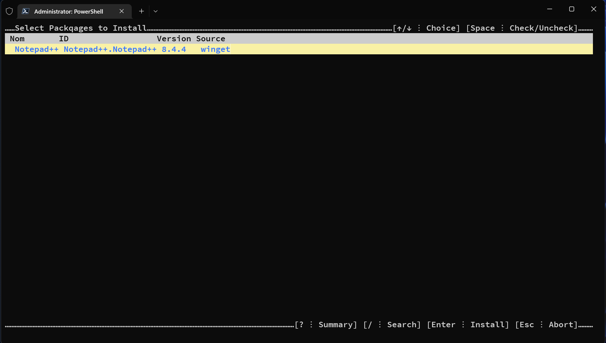

```
           _                      _                       _
__      __(_) _ __    __ _   ___ | |_  _ __    ___   ___ | |__
\ \ /\ / /| || '_ \  / _` | / _ \| __|| '_ \  / _ \ / __|| '_ \
 \ V  V / | || | | || (_| ||  __/| |_ | |_) || (_) |\__ \| | | |
  \_/\_/  |_||_| |_| \__, | \___| \__|| .__/  \___/ |___/|_| |_|
                     |___/            |_|
```

A small set of functions to help using winget.

It's TUI (Terminal User Interface) entirely written in Powershell.

For now, it't only tested with Windows Terminal runnning the latest (7.2.6) Powershell Core

The 2 main functions are :
- wgSearchList
- wgUpgradeList

They both return a list of objects that contain (among other informations) the id's of the selected packages

example :

``` Powershell
$list = wgSearchList -Search notepad++
```
This will bring the following screen :


