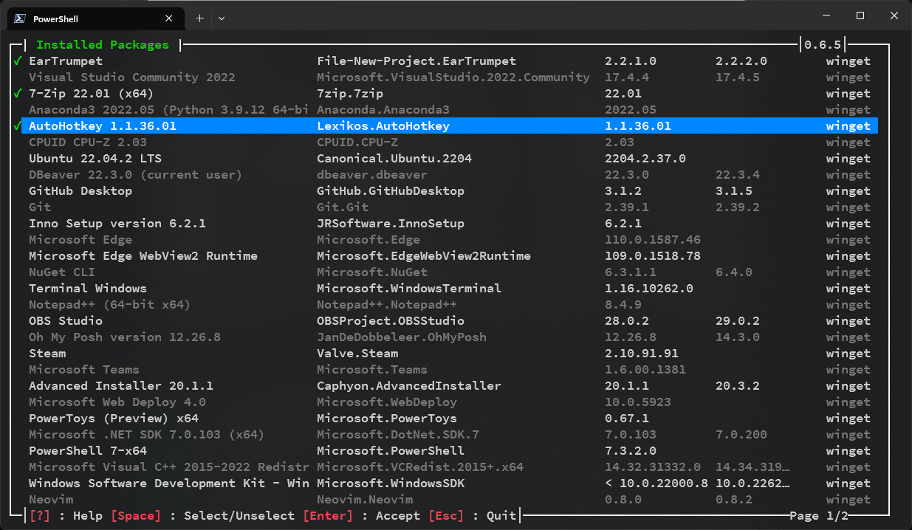
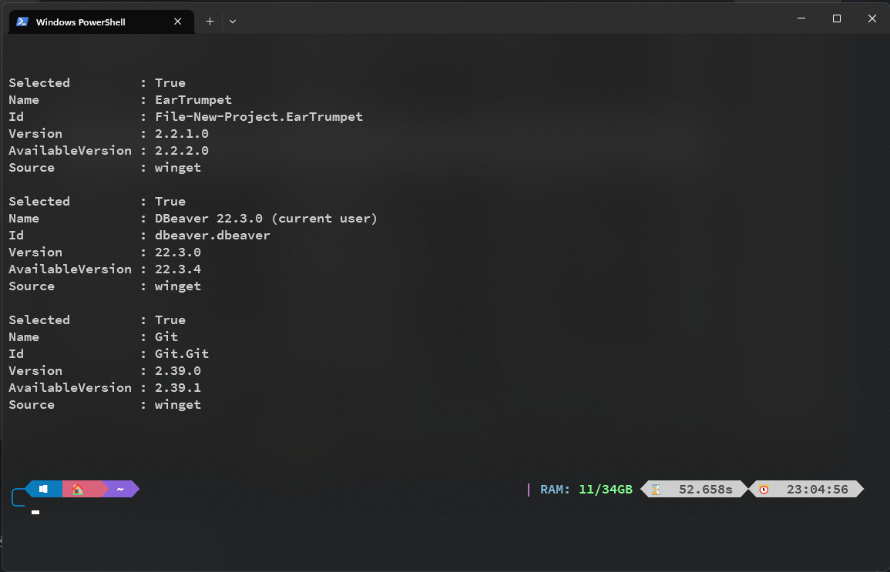
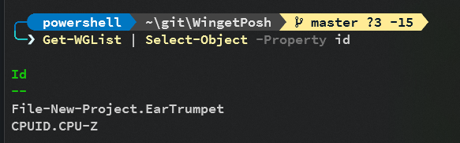
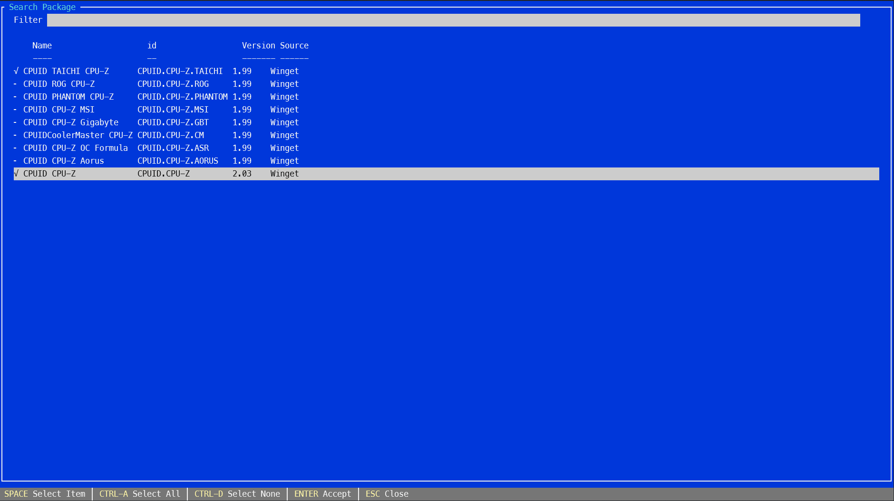
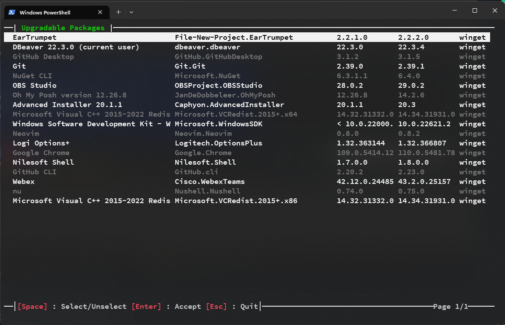

```
           _                      _                       _
__      __(_) _ __    __ _   ___ | |_  _ __    ___   ___ | |__
\ \ /\ / /| || '_ \  / _` | / _ \| __|| '_ \  / _ \ / __|| '_ \
 \ V  V / | || | | || (_| ||  __/| |_ | |_) || (_) |\__ \| | | |
  \_/\_/  |_||_| |_| \__, | \___| \__|| .__/  \___/ |___/|_| |_|
                     |___/            |_|
```
***


## Demo
https://www.youtube.com/watch?v=1qxrRrgJVVw&ab_channel=YGO


A small set of functions to help using winget.

It's TUI (Terminal User Interface) entirely written in Powershell.
It has one dependenciy : Microsoft.PowerShell.ConsoleGuiTools

For now, it't only tested with Windows Terminal runnning the latest (7.2.6) Powershell Core

The availablle functions are :
- Get-WGList
- Get-WGSearch
- Get-WGUpdate
- Set-WGInstall
- Set-WGRemove
  
  
### Examples
``` Powershell
  Get-WGList
```


This function allows multiselection.
When at least one package is selected, when the function is exitted with "Return", an Object list is returned.


When Hit return .....


Of course, we can use this object collection to extract some usefull data .....



***

``` Powershell
  Get-WGSearch cpu-z
```


``` Powershell
  Get-WGUpdate
```


***

## Search and install a package

``` Powershell
  Get-WGSearch "notepad++" | Select-Object -Property Id | Set-WGInstall
```
or
``` Powershell
  $id = Get-WGSearch "notepad++" | Select-Object -Property Id
  winget install $id
```
or
``` Powershell
  $pkg = Get-WGSearch "notepad++"
  winget install $pkg.id
```

***

## Select and update an installed package
``` Powershell
  Get-WGUpgrade | Select-Object -Property id | set-WGUpgrade
```
or
``` Powershell
  $id = Get-WGUpgrade | Select-Object -Property id
  winget update $id
```
or
``` Powershell
  $pkg = Get-WGUpgrade
  winget update $pkg.id
```

***

## Select and uninstall an installed package
``` Powershell
  Get-WGList | Select-Object -Property id | Set-WGRemove
```

or

``` Powershell
 $id = Get-WGList | Select-Object -Property id
 winget uninstall $id
```

or
``` Powershell
  $pkg = Get-WGList
  winget uninstall $pkg.id
```