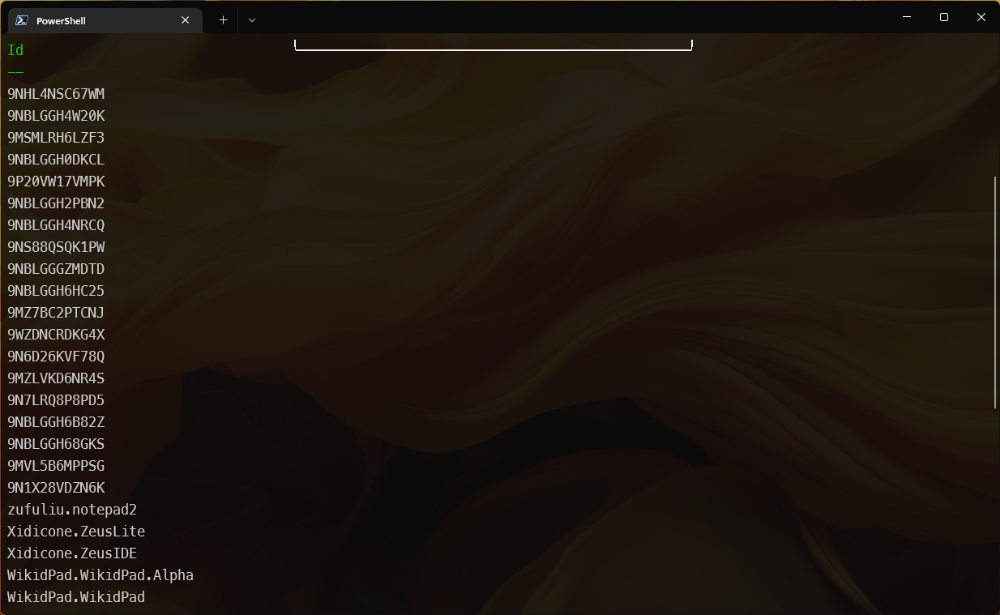
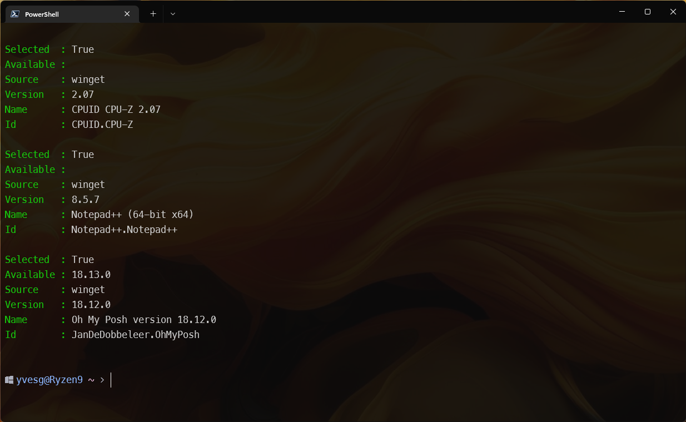
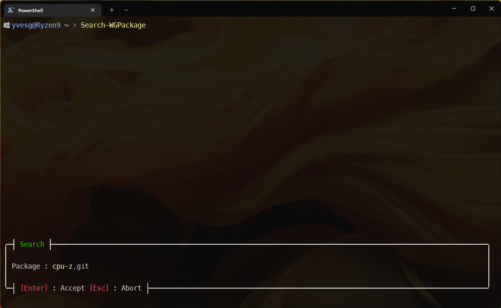

```
           _                      _                       _
__      __(_) _ __    __ _   ___ | |_  _ __    ___   ___ | |__
\ \ /\ / /| || '_ \  / _` | / _ \| __|| '_ \  / _ \ / __|| '_ \
 \ V  V / | || | | || (_| ||  __/| |_ | |_) || (_) |\__ \| | | |
  \_/\_/  |_||_| |_| \__, | \___| \__|| .__/  \___/ |___/|_| |_|
                     |___/            |_|
                 ___       ___       ___
                / _ \     ( _ )     / _ \
               | | | |    / _ \    | | | |
               | |_| | _ | (_) | _ | |_| |
                \___/ (_) \___/ (_) \___/
```
***

## Demo
https://youtu.be/DmUAo6TDVvA


A set of functions to help using winget.

Entirely written in __Powershell__, it has 2 types of functions : visuals and non visuals.

No dependencies are used to ensure compatibility with Powershell 5.1

The availablle functions are :
- Get-WGPackage [-source] [-interactive] [-uninstall] [-update] [-apply]
- Search-WGPackage [-package "search terms"] [-source "source"] [-interactive] [-install] [-allowsearch]
- Get-WGList [-source "source"]
- Install-WGPackage [-package] [-source] [-silent]
- Invoke-Winget 
- Out-Object              
- Show-WGList                 
- Uninstall-WGPackage         
- Update-WGPackage [-Update] 
- Search-WGPackage
  
  
***
## Installation
### Stable (0.7.9)
``` Powershell
  Install-Module -Name wingetposh -Scope CurrentUser
```

### Beta 
``` Powershell
  Install-module wingetposh -scope currentuser -allowprerelease
```
# IMPORTANT 
Don't forget to import the module after the installation !
When it's imported, the localized resources are downloaded from the winget repository.

### Remark : 
To install in powershell 5.1, you need to install the latest "PowershellGet"
``` Powershell
Install-Module PowerShellGet -AllowClobber -Force
```


Close and re-open the powershell 5.1 terminal to make changes effective.
***

## History
See [History.md](./history.md) for the complete module history.

There is a "?" on the bottom of the window, for interactive commands.
Pressing "?" displays a "help" in the context of the running command.

``` Powershell
   Get-Command -module wingetposh
```


## Get-WGPackage

```
  Get-WGPackage [-source] [-interactive] [-uninstall] [-update] [-apply]
```
- -source : Specify the source to filter on
- -interactive : Switch that command the display of the GUI
- -uninstall : switch to specify if the selected packages will be uninstalled
- -update : switch to specify if the selected packages will be updated
- -apply : additionnal switch to confirm -uninstall & -update

### Examples

``` powershell
  Get-WGPackage -source winget
```
Get a hashtable with the installed packages, filtered on the source "winget"

``` powershell
  Get-WGPackage -source winget | Out-Object
```
Get an Object (or an array of objects) with the installed packages, filtered on the source "winget"

## Search-Package

```
  Search-WGPackage "package" [-source] [-interactive] [-install] [-allowsearch]
```
- -source : Specify the source to filter on
- -interactive : Switch that command the display of the GUI
- -install : Lauch the installation of the selected packages
- -allowsearch : Allow to search on new keywords by pressing "F3" in the grid.

### Examples

``` powershell
  Search-WGPackage notepad -source winget | Out-Object | Select-Object -Property id
```



``` Powershell
  Show-WGList
```


This function allows multiselection, by pressing "space" on the selected line.
When at least one package is selected, when the function is exitted with "Return", an Object list is returned.


When Hit return .....


The result is a hashtable, faster and more memory efficient.

But the result can be converted to object by piping it to Out-Object

``` Powershell
   Show-WGlist | Out-Object
```


And, of course, we can pipe this result to perform additionnal operations .....

``` Powershell
   Show-WGList | Out-Object | Select-Object -Property id
```


***
## Search Packages
The -Package parameter is not mandatory.
If omitted, wingetposh will display a popup to enter the packages to search.

``` Powershell
  Search-WGPackage
```


***

## Converting results to PSCustomObject arrays

``` Powershell
  Get-WGList | Out-Object
```

***

## Search and install a package

If no **-package** parameter is specified, the function will popup a window to enter the terms to search.

The source can be specified to limit the number of results.  EG : *-source winget*

``` Powershell
  Install-WGPackage
```


***

## Select and update an installed package
 
 To confirm the update, the *-apply* switch must be provided.  Otherwise, the function will only return a list of the selected packages.
 

```Powershell
  Update-WGPackage -source winget -apply
```


***

## Select and uninstall an installed package
 To confirm the update, the *-apply* switch must be provided.  Otherwise, the function will only return a list of the selected packages.
``` Powershell
  Uninstall-WGPackage -source winget -apply
```


## Generic function to convert winget results to PSCustomObject

``` Powershell
  Invoke-Winget "winget list" | Out-Object | Where-Object {$_.Nom -like "*code*"}
```


# Configuration

Starting 0.8.0-beta5 version, a config file is used to store some global parameters.
The file is stored in
``` powershell
$env:USERPROFILE/.config/.wingetposh/config.json
```


To change an option, use the **Set-WingetposhConfig**

## Example
To allow the use of nerd font special characters in the grid, change the option "UseNerdFont" to true
``` Powershell
  Set-WingetposhConfig -param UseNerdFont -value $true
```

To force silent installation of packages, set "SilentInstall" to true
``` powershell
  Set-WingetposhConfig -param SilentInstall -value $true
```
