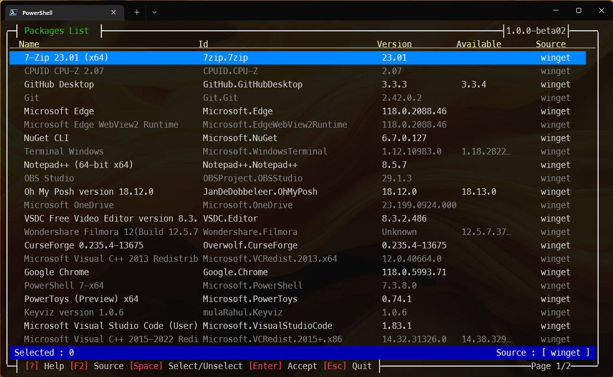
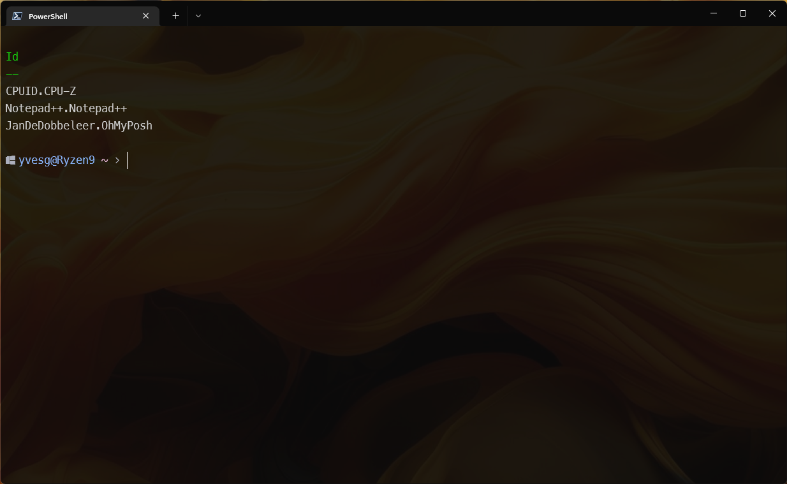
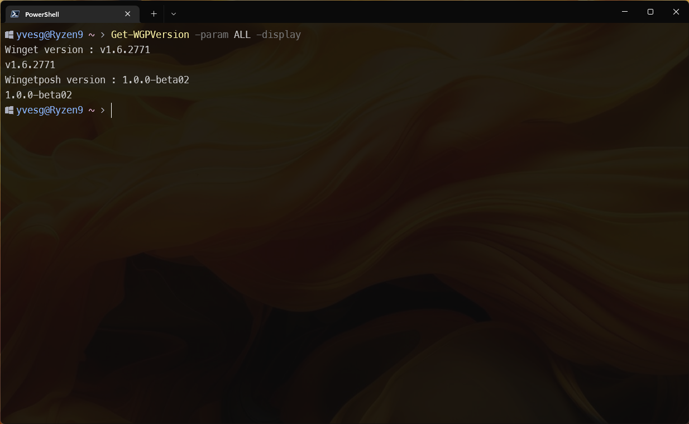

***
## Demo
https://youtu.be/rH9PcEj8u5A


A set of functions to help using winget.

Entirely written in __Powershell__, it has 2 types of functions : visuals and non visuals.

No dependencies are used to ensure compatibility with Powershell 5.1

***
## Remaks :
  The goal of this module is not really the same as *Microsoft.WinGet.Client* 

  Basically, it was focused on the "graphical interface" aspect. The "parsing" part was added naturally.
  Unlike the official module, it is 100% written in Powershell in order to be compatible with version 5.1 and requires NO external dependency.

  But, in the end, it offers the same functionalities, new ones will be added to it as time goes on. (Scoop support, .....)
***
The availablle functions are :
- Get-WGPackage [-source] [-interactive] [-uninstall] [-update] [-apply]
- Search-WGPackage [-package "search terms"] [-source "source"] [-interactive] [-install] [-allowsearch]
- Get-WGList [-source "source"]
- Get-WGSources
- Install-WGPackage [-package] [-source] [-silent] [-acceptpackageagreements] [acceptsourceagreements]
- Invoke-Winget 
- Out-Object              
- Show-WGList                 
- Uninstall-WGPackage  *(deprecated)*        
- Update-WGPackage [-Update]  *(deprecated)*
- Set-WingetposhConfig -param -value
- Get-WingetposhConfig [-display]
- Reset-WingetposhConfig
- Get-WGPVersions [-param]
- Build-WGInstallFile [-file]
  

Starting with version 1.0.0, **Scoop** (if present) is supported.
This is a limited support but it will grow with the next versions of WingetPosh.

When the module is imported for the first time, Scoop is detected and if present, his usage is flagged in the config file.

Scoop integration can be activated or deactivated with :
``` Powershell
  Set-WingetposhConfig -param includeScoop $True / $False
```
***
## Installation

``` Powershell
  Install-Module -Name wingetposh -Scope CurrentUser
```
# IMPORTANT 
Don't forget to import the module after the installation !
*Ideally, put it in your profile file ($PROFILE)*
When it's imported, the localized resources are downloaded from the winget repository.

### Remark : 
To install in powershell 5.1, you need to install the latest "PowershellGet"
``` Powershell
Install-Module PowerShellGet -AllowClobber -Force
```

Close and re-open the powershell 5.1 terminal to make changes effective.
***

## History
See [History.md](./history.md) for the complete module history.

There is a "?" on the bottom of the window, for interactive commands.
Pressing "?" displays a "help" in the context of the running command.

``` Powershell
   Get-Command -module wingetposh
```


## Get-WGPackage

```
  Get-WGPackage [-source] [-interactive] [-uninstall] [-update] [-apply]
```
- -source : Specify the source to filter on
- -interactive : Switch that command the display of the GUI
- -uninstall : switch to specify if the selected packages will be uninstalled
- -update : switch to specify if the selected packages will be updated
- -apply : additionnal switch to confirm -uninstall & -update

### Examples

``` powershell
  Get-WGPackage -source winget
```
Get a hashtable with the installed packages, filtered on the source "winget"

``` powershell
  Get-WGPackage -source winget | Out-Object
```
Get an Object (or an array of objects) with the installed packages, filtered on the source "winget"

## Search-Package

```
  Search-WGPackage "package" [-source] [-interactive] [-install] [-allowsearch]
```
- -source : Specify the source to filter on
- -interactive : Switch that command the display of the GUI
- -install : Lauch the installation of the selected packages
- -allowsearch : Allow to search on new keywords by pressing "F3" in the grid.

### Examples

``` powershell
  Search-WGPackage notepad -source winget | Out-Object | Select-Object -Property id
```


``` Powershell
  Show-WGList
```


This screen allow to select (Space) the package for which information will be returned.
It is also possible to flag some packages for uninstallation (with "Del") and for update (with "u")
**Note:** Only updatable packages will be available to update.
Pressing "Ctrl-U" will flag every updatable package to be updated.

Info, Uninstall and Update can be combined.


Pressing enter launches the process. (See demo vidéo)


When Hit return .....


The result is an array of PSObject

And, of course, we can pipe this result to perform additionnal operations .....

``` Powershell
   Show-WGList | Select-Object -Property id
```



***
## Search Packages
The -Package parameter is not mandatory.
If omitted, wingetposh will display a popup to enter the packages to search.

``` Powershell
  Search-WGPackage
```
Search-WGPackage now accept multiple search keys.  They must be comma-separated.
If the "-package" switch is used, the search string must be quoted.
If the interactive search is used, no quotes needed.


***

## Converting results to PSCustomObject arrays

``` Powershell
  Search-WGPackage -package "cpu-z,git" | Out-Object
```

***

## Search and install a package

Just as Search-WGPackage, Install-WGPackage now accept multiple search keys.  They must be comma-separated.
If the "-package" switch is used, the search string must be quoted.
If the interactive search is used, no quotes needed.

If no **-package** parameter is specified, the function will popup a window to enter the terms to search.

The source can be specified to limit the number of results.  EG : *-source winget*

``` Powershell
  Install-WGPackage
```


If no source is specified, the display grid will allow to filter the sources by pressing **F2** key.


Multiple packages, from multiple source can be selected at once to install.


***

## ~~Select and update an installed package~~ 
 **(Deprecated)**

 To confirm the update, the *-apply* switch must be provided.  Otherwise, the function will only return a list of the selected packages.
 

```Powershell
  Update-WGPackage -source winget -apply
```

***

## Building a config file to replicate packages installation

``` Powershell
  Build-WGInstallFile -file RyzenConfig.json
```
This function will display a grid similar to **Show-WGList".
But when confirmed with "Enter", the function will generate a JSON config file with every package informations.
This file can be used for future installation or replication of the same package list.

If no "-file" parameter is present, the defaut config file is "WGConfig.json"

**Remark :** The import function will be soon available in a next beta version. 

***

## ~~Select and uninstall an installed package~~
 **(Deprecated)**

 To confirm the update, the *-apply* switch must be provided.  Otherwise, the function will only return a list of the selected packages.
``` Powershell
  Uninstall-WGPackage -source winget -apply
```

## Generic function to convert winget results to PSCustomObject

``` Powershell
  Invoke-Winget "winget list" | Out-Object | Where-Object {$_.Name -like "*code*"}
```


# Configuration

Starting 0.8.0-beta5 version, a config file is used to store some global parameters.
The file is stored in
``` powershell
$env:USERPROFILE/.config/.wingetposh/config.json
```


## Set an option
  Change the value of an option in the config file

## Example
To allow the use of nerd font special characters in the grid, change the option "UseNerdFont" to true
``` Powershell
  Set-WingetposhConfig -param UseNerdFont -value $true
```

To force silent installation of packages, set "SilentInstall" to true
``` powershell
  Set-WingetposhConfig -param SilentInstall -value $true
```

## Reset the config file
  Reset to default every options in the config file

``` Powershell
  Reset-WingetposhConfig
```

## Display the options of the confid file
  Display the value of the options in the config file

``` Powershell
  Get-WingetposhConfig -display
```


## Get-WGPVersions -param All
  Display Winget and WingetPosh versions
  Available parameters : "All", "Winget", "WGP"
  ``` Powershell
  Get-WGPVersions -param All
```
