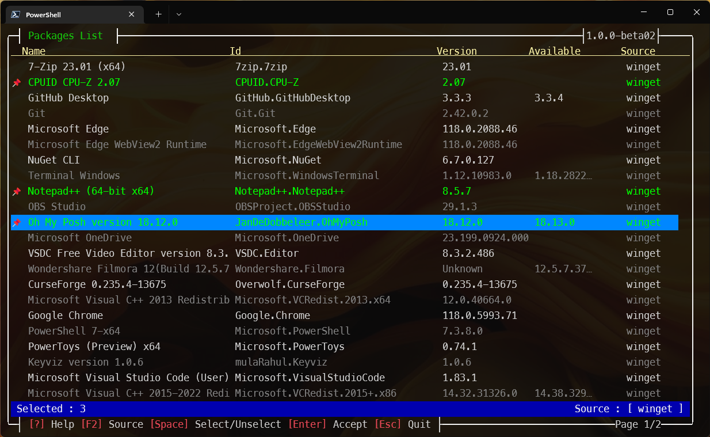
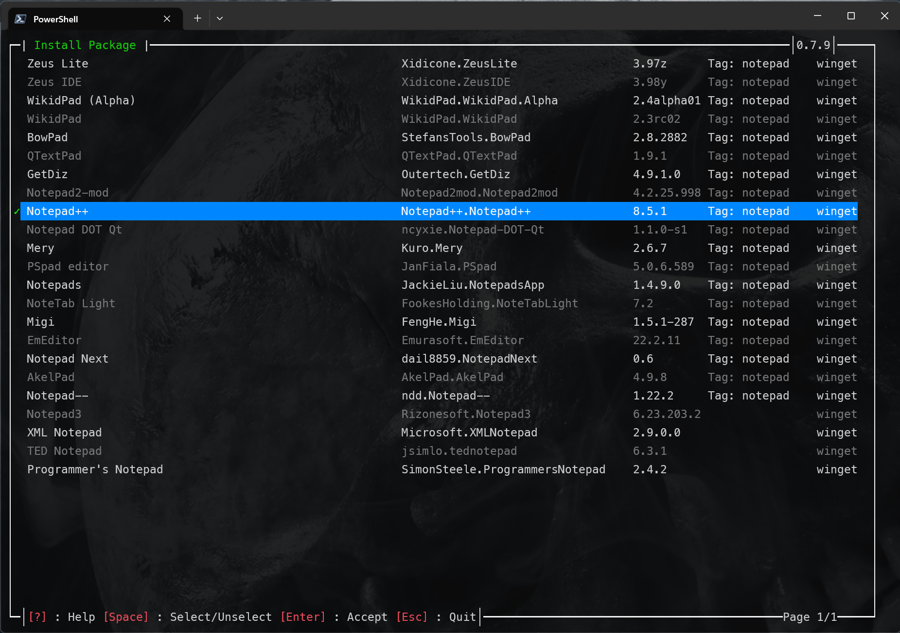
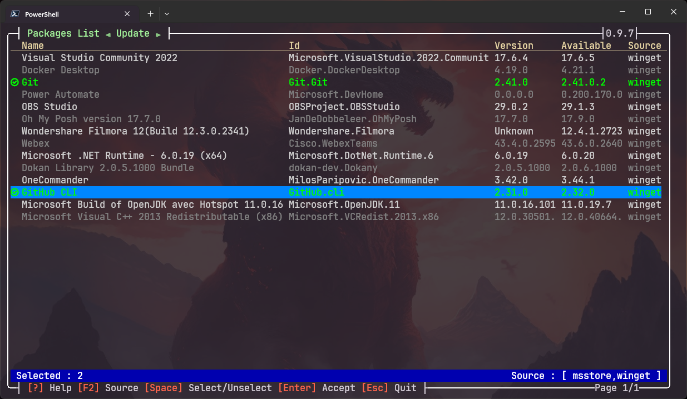

```
           _                      _                       _
__      __(_) _ __    __ _   ___ | |_  _ __    ___   ___ | |__
\ \ /\ / /| || '_ \  / _` | / _ \| __|| '_ \  / _ \ / __|| '_ \
 \ V  V / | || | | || (_| ||  __/| |_ | |_) || (_) |\__ \| | | |
  \_/\_/  |_||_| |_| \__, | \___| \__|| .__/  \___/ |___/|_| |_|
                     |___/            |_|
```
***

## Demo
https://youtu.be/8hW1kMu2Dq8


A set of functions to help using winget.

Entirely written in __Powershell__, it has 2 types of functions : visuals and non visuals.

No dependencies are used to ensure compatibility with Powershell 5.1

The availablle functions are :
- Get-WGList                
- Install-WGPackage [-Install] [-package]
- Invoke-Winget 
- Out-Object              
- Show-WGList                 
- Uninstall-WGPackage         
- Update-WGPackage [-Update] 
- Search-WGPackage
  
  
***
## Installation
``` Powershell
  Install-Module -Name wingetposh -Scope CurrentUser
```
### Remark : 
To install in powershell 5.1, you need to install the latest "PowershellGet"
``` Powershell
Install-Module PowerShellGet -AllowClobber -Force
```
Close and re-open the powershell 5.1 terminal to make changes effective.
***

## History
### 0.5.1 : 
- Fixed the show-WGList bug when there is no updatable packages to show.
### 0.5.2 : 
- Removed the "-Interactive" switch to search-WGPackage.       
- Removed the search parameter from search-WGPackage.
- Allowing multiple selection in uninstall-WGPackage.
- Removing crash brug when no package is found in search-WGPackage.
- Removing the "-Interactive" switch to updage-WGPackage.  If no Object is passed through the pipeline, it will automatically display an interactive grid
- Update readme.md

### 0.5.4 : 
- Addind a license file.

### 0.5.5 : 
- Adding license acceptance when installing module

### 0.5.6 : 
        - Adding headless functions : Get-WGList and Get-WGUpdatables

### 0.6.0 :
        - Removing "Microsoft.PowerShell.ConsoleGuiTools" dependance to add Powershell 5.1 compatibility
        - Rewriting the TUI in full powershell (some flickering still to fix)
        - Adding "Invoke-Winget" funtion to add generic call to Winget

### 0.6.1 : 
        - Fix -Install switch of Install-WGPAckage
        - Rename Show-WGUpdatables to Update-WGPackages
        - Add a switch -Update to Update-WGPackages

### 0.6.2 :
        - Fix flickering
        - rename Update-WGPackages to Update-WGPackage for uniformity
        - in Install-WGPackage, F3 allows to run a new search
        - Version of the module shown in the window frame
        
### 0.6.3 : 
        - remove the module version of the window frame

### 0.6.4 :
        - Add '+' and '-' keys for selections in the grid
        - Version of the module shown in the window frame (back)
        - add "?" to display help

### 0.6.5 :
        - refine windows drawing
        - add a "package" parameter to Install-WGPackage

### 0.6.6 :
        - Correctiong bugs in install, uninstall and update functions
        - Fixing the order of the install-WGPackage parameters

### 0.7.0 :
        - Changing search mode.  Now the search is on everything, not only the name
        - Improving winget result parsing
        - Every function now returns a hastable.  Faster, lighter
        - Adding a "Out-Object" function to convert hashtable results in PsCustomObject arrays (if needed)
        - Adding a "Search-WGPackage" to search without the graphical interface
  
### 0.7.2 : 
        - Minor bug fixes
        
### 0.7.3 :
        - fixing visual function (using hastables)

### 0.7.4 :
        - fixing bug with visual functions returning multiple objects

### 0.7.5 :
        - Fixing the update-wgpackage when multiple packages selected

### 0.7.9 :
        - Start Using runspaces to multitask the module.
          First usage is for animating the waitings.
          Last version before heavy code restucture / rewrite
        - Small visual improvements

There is a "?" on the bottom of the window, for interactive commands.
Pressing "?" displays a "help" in the context of the running command.
### Examples
``` Powershell
   Get-Command -module wingetposh
```

``` Powershell
  Show-WGList
```


This function allows multiselection, by pressing "space" on the selected line.
When at least one package is selected, when the function is exitted with "Return", an Object list is returned.


When Hit return .....


The result is a hashtable, faster and more memory efficient.

But the result can be converted to object by piping it to Out-Object

``` Powershell
   Show-WGlist | Out-Object
```


And, of course, we can pipe this result to perform additionnal operations .....

``` Powershell
   Show-WGList | Out-Object | Select-Object -Property id
```


***
## Search Packages
The -Package parameter is mandatory.

``` Powershell
  Search-WGPackage -Package code
```
***

## Converting results to PSCustomObject arrays

``` Powershell
  Get-WGList | Out-Object
```

***

## Search and install a package

The (optionnal) **-Install** parameter will launch the installation of the selected package(s).
If no **-package** parameter is specified, the function will popup a window to enter the terms to search.

``` Powershell
  Install-WGPackage -Install
```




***

## Select and update an installed package
 
```Powershell
  Update-WGPackage -update
```


***

## Select and uninstall an installed package
 
``` Powershell
  Uninstall-WGPackage
```


## Generic function to convert winget results to PSCustomObject

``` Powershell
  Invoke-Winget "winget list" | Out-Object | Where-Object {$_.Nom -like "*code*"}
```
